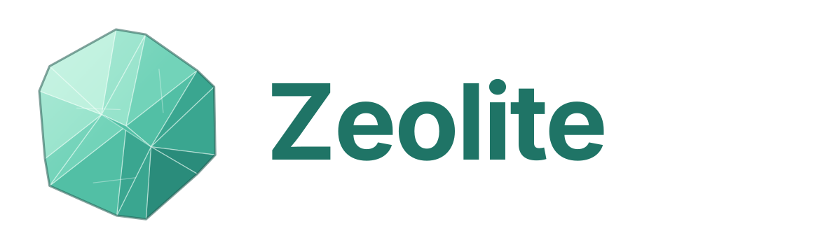

<p align="center"></p>

Zeolite is a note-taking and note-collecting app in the spirit of Obsidian.
Notes are plain Markdown files, compatible with Obsidian vaults, and the app
is shared between Windows and Android.

- Specification: [docs/feasibility.md](docs/feasibility.md)
- Sync with your own server (WebDAV, Docker): [docs/sync.md](docs/sync.md)
- Taxonomy and numbering: [docs/taxonomy.md](docs/taxonomy.md)

## Repository layout

| Path | Content |
| ---- | ------- |
| `packages/core` | Shared, platform-independent logic: taxonomy, `XX.YY.ZZ.NNN` IDs, tasks, Attn points, decisions, dates, tags, TOC. Unit-tested. |
| `apps/web` | Shared UI (Svelte + CodeMirror 6), with one storage adapter per platform (browser, Windows, Android). |
| `apps/desktop` | Windows app (Tauri 2): portable `Zeolite.exe` and an installer. |
| `apps/mobile` | Android app (Capacitor 8): APK. |
| `server/webdav` | Docker setup of a WebDAV server for syncing vaults. |
| `assets/logo` | Logo: an icon and a wordmark (SVG). |
| `docs` | Specification. |

## Windows and Android apps

GitHub builds both apps on request: **Actions → Build apps → Run workflow**
(pushes only run the checks and the portable HTML). When the run is finished,
download the files from its **Artifacts** section:

| Artifact | What it is |
| -------- | ---------- |
| `Zeolite-windows-portable-exe` | `Zeolite.exe`: runs without installing (uses the WebView2 runtime built into Windows 10/11). Truly portable: its settings (last vault, chosen folders, sync settings) live in a `Zeolite-data` folder next to the exe, nothing in the user profile. |
| `Zeolite-windows-installer` | Installer for the current user (no admin rights). |
| `Zeolite-android-apk` | `Zeolite-android.apk`: install on the phone (allow "install unknown apps" once). |
| `Zeolite-portable-html` | The single-file browser version. |

- **Windows:** 📂 opens the system folder picker; the vault reopens by itself
  at the next start.
- **Android:** the first 📂 asks for **All files access** (as Obsidian and
  Syncthing-Fork do), then an in-app browser picks the vault folder, e.g. the
  one Syncthing syncs. It reopens by itself at the next start.

Local builds: `npm run tauri -w @zeolite/desktop build` (needs Rust; on
Windows the WebView2 runtime) and `npx cap sync android` in `apps/mobile`, then
`./gradlew assembleDebug` in `apps/mobile/android` (needs the Android SDK).

## Portable use (no install, e.g. a work PC)

`npm run build:portable` produces **one file**: `apps/web/dist-portable/Zeolite.html`
(about 4.6 MB, everything included, works offline).

1. Copy `Zeolite.html` anywhere: your documents, a USB stick, a network share,
   or next to your vault folder.
2. Open it with **Edge** or **Chrome** (double-click, or drag it into the browser).
3. Press 📂 **Open folder** and choose your vault. Next time, press
   **Reopen "<vault>"** and confirm access once.

If 📂 explains that the page cannot open folders, the file is usually being
shown inside another app's viewer (mail, Teams, a chat app) or in Firefox:
save it to disk and open the saved file with Edge or Chrome. Meanwhile
"Open a read-only copy" works in any browser (changes are not saved).

Nothing is installed and no admin rights are needed; notes stay plain `.md`
files in your folder (Syncthing keeps syncing them as usual). Firefox cannot
open folders. A portable Windows app (`Zeolite.exe`, no installer, using the
WebView2 runtime built into Windows 10/11) will come with the Tauri shell.

## Development

```sh
npm install
npm test          # core unit tests
npm run check     # type checks
npm run dev       # UI on http://localhost:5173 (demo vault in memory)
npm run build
npm run taxonomy -- list --vault "path/to/vault"   # manage the taxonomy (see below)
```

### Taxonomy from the command line

```sh
npm run taxonomy -- add category Aviation            # next free code
npm run taxonomy -- add sub 01 Drones --code 08      # Sub-PARA under PARA 01
npm run taxonomy -- add para Ideas --folder "05 Ideas"
npm run taxonomy -- rename category 06 Programmes --notes   # --notes: also in every note
npm run taxonomy -- remove sub 01 07                 # refused while IDs use it
```

Add `--vault "path/to/vault"` to each command, or run it from inside the
vault folder. In the app, use Tags → ⚙ Manage taxonomy.

In the browser the app starts with an in-memory demo vault. **📂 Open folder**
works on a real vault in Chrome or Edge desktop, through the File System
Access API.

## Status

Done:

- Editor with toolbar, plus edit, split and view modes.
- Obsidian-flavoured preview: wiki links, embeds, callouts, highlights,
  inline fields.
- Images by paste or drop. Attachments are listed in the Files panel: view,
  see which notes use them, link them, open them with their app (Windows).
- Dynamic and static TOC; clicking an entry (or any `[[#Heading]]` or
  `[text](#heading)` link) scrolls the preview and the editor to the
  heading, and ← returns. In the editor (Edit mode, phones) a ```toc block
  shows a clickable contents list, static TOC entries are clickable, and
  Ctrl/Cmd+click follows any [[link]].
- Tasks: toolbar buttons, state cycling, ticking from the preview, `[due:: …]`
  with natural-language dates.
- Attn points: insert, resolve, convert to task.
- Decisions: `Decide::` (decision required) and `Decision::` (taken, with
  `[decided:: date]`), from two toolbar buttons; listed in the Tasks tab and
  by `LIST Decide` / `LIST Decision` queries.
- New-note dialog: PARA ID generation, Journal, Inbox and Free notes.
- Rename or move a note: click its path at the top, or press F2. PARA
  notes keep their ID; links across the vault are updated.
- Web links open in the default browser (in the Windows and Android apps
  too); in the editor, Ctrl/Cmd+click a web address to open it.
- Settings (⚙): PARA folders (with renaming), attachments, journal,
  templates, Inbox/searches/exports folders (vault, Obsidian-compatible
  where Obsidian has the setting), theme, text size, opening view.
- Shared folders (OneDrive/SharePoint, Syncthing, network drives) — off by
  default, ⚙ Settings → This device: files
  changed by other apps or colleagues are picked up within seconds (the
  open note too, when it has no edits of ours); a save never overwrites
  a version changed meanwhile (it is kept as a conflict copy); OneDrive
  conflict copies (`Note-PCNAME.md`) are listed with the other conflicts.
- Sync with a WebDAV server, e.g. a container on your Docker server
  (⇅ in the sidebar): two-way, only changed files (unchanged local files
  are not even re-read), conflicts kept as
  Syncthing-style copies, deletions to `.trash`. See [docs/sync.md](docs/sync.md).
- User guide: ❓ in the sidebar (or F1) writes `_system/Zeolite User Guide.md`
  into the vault (refreshed to the current version each time) and opens it.
  Source: [docs/user-guide.md](docs/user-guide.md).
- Back and forward (← → in the top bar, Alt+← / Alt+→, or the mouse's side
  buttons): after following a link, return to the note you came from, at
  the same scroll position and cursor, like in a web browser.
- Resizable sidebar and editor/preview separator (kept per device).
- Tabs like Obsidian: a note opens in the current tab; ＋ (or Ctrl/middle
  click in the Files list) opens a new tab; each tab has its own back /
  forward history; open tabs are remembered per vault.
- Note embeds: `![[Note]]` and `![[Note#Heading]]` show the note (or the
  section) in a frame; ticking a task there updates the embedded note.
- Single line breaks are line breaks (like Obsidian's default). On phones
  the toolbar wraps onto rows; ``` (code block) and TOC buttons.
- Android: system back closes dialogs/menu, twice to exit.
- Move a note to another folder by dragging it onto the folder in the Files
  list (or onto "vault root" below the list); links are updated.
- New folder (📁＋ New folder at the top of the Files list, or ＋ next to a
  folder for a sub-folder); `Projects/2026` creates both levels. Empty
  folders are shown, so notes can be dragged into them.
- Insert a link ([[ ]] button or Ctrl+K): search notes by name, title, ID or
  folder, optionally pick a heading, set the text shown or embed it; the
  dialog shows the result and a short syntax help. Typing `[[` in the
  editor also suggests notes, and `[[Note#` its headings.
- Delete a folder (🗑 next to its name): it moves to `.trash` with
  everything in it; the notes linking into it are listed first.
- Demo vault clearly marked as not saved; opening an empty folder offers to
  set it up (taxonomy, templates, a first note).
- Delete a note (🗑 in the top bar): it moves to the vault's `.trash`
  folder, like Obsidian; links to it are listed first.
- Opening an Obsidian vault: nothing to convert. Zeolite follows the vault's
  `.obsidian` settings (templates folder, daily notes folder/format/template,
  attachment folder). The only Zeolite file is `_system/Taxonomy.md`, needed
  for numbering only; the app offers to create it (Tags → ⚙ Manage taxonomy).
- Change a note's ID, or give an imported note its first ID: click the ID
  badge (or ＋ Assign ID) in the top bar. Next number in the chosen series,
  or a number typed by hand (refused if taken), taxonomy tags swapped,
  optional move to the PARA folder, links updated.
- Archiving.
- ID collision detection and renumbering, with link updates.
- Sync-conflict listing.
- Tag panel grouped by the taxonomy.
- Task and Attn panel, simple search.
- Dataview queries: the common subset of the query language renders live
  results, and ticking a task in the results updates its note.
- Chord sheets, compatible with Obsidian's Chord Sheets plugin: ```chords
  blocks (also `chords-ukulele`, `chords-mandolin`), chords over lyrics or
  inline in [brackets], custom shapes like `Bbadd13[x13333]`. Diagrams
  (guitar, ukulele; click for other fingerings, hover a chord), transpose
  ♭/♯ in the view (sharps or flats follow the new key), then "Write to
  note". Autoscroll for playing (speed saved in the note as `autoscroll`,
  screen kept awake). PDF export keeps chords aligned (monospaced font) and
  adds the diagrams. Chords highlighted in the editor.
- Templates (Obsidian-compatible variables): pick one in New note
  (auto-suggested by Sub-PARA, PARA or note type), insert one with
  📄 Template, manage them with the 📄 button in the sidebar.
- PDF export (PDF button or Ctrl+P): the note or its whole folder, real
  selectable text, clickable table of contents with page numbers, page
  numbers, images and current Dataview results; download it or save it to
  `exports/` in the vault.
- Taxonomy management in the app (Tags → ⚙ Manage taxonomy) and from the
  command line.
- Query builder (🔍 Query): build a query from a form, insert it in a note or
  save it as a search note in `Searches/`.

Next:

- Test the Android app on a device (folder access, Syncthing), then polish
  the phone layout (toolbar above the keyboard).
- SQLite WASM index with full-text search.
- Renaming and merging tags.
- Live preview.
